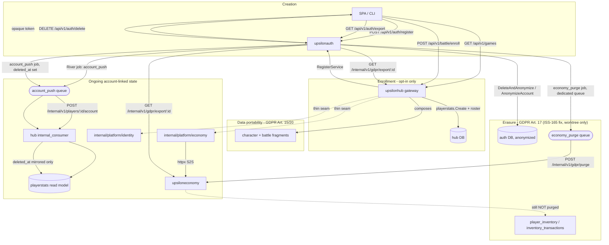

# Account Lifecycle

**Date:** 2026-09-17
**Scope:** Global Project Architecture — cross-cutting, post service-extraction (Phase 6 cutover)

> Traces one account's life across the extracted substrates: creation in
> `upsilonauth`, opt-in game/service enrollment, the durable read-model sync
> that keeps `upsilonhub` denormalized, GDPR data portability (Art. 15/20),
> and GDPR erasure (Art. 17). Companion to [`service_map.md`](service_map.md)
> (ownership) and [`how_to_add_a_service.md`](how_to_add_a_service.md) (the
> forward-looking contract every new service must honor). As of this writing
> **ISS-165's erasure fix has been implemented, tested, and independently
> reviewed (OKAY) in a separate worktree** (`upsilon-hub-iss-165`, branch
> `iss-165-gdpr-erasure-economy`) but **is not yet merged** into the primary
> checkout — see §7. A known residual gap survives even after this fix
> (inventory/inventory-ledger purge, §7.4) and is flagged for a follow-up
> issue, not yet filed.

## 1. Overview

Post-extraction, no single service owns "the account." `upsilonauth` is the
sole identity/SSO authority (account row, opaque tokens, per-account service
registrations) and the sole GDPR authority (owns the only public export and
the only erasure trigger). Every other service that touches personal data —
`upsiloneconomy` (wallet/ledger/inventory) and each game module (today only
`upsilonhub`'s `battle` game, via `internal/platform/character` and
`internal/games/battle`) — is a **fragment owner**: it holds its own slice of
personal data behind an internal, S2S-token-guarded surface, and never
initiates enrollment or erasure on its own.

## 2. Stage → owning service → what fires → what consumes it

| Stage | Owning service | What fires | What consumes it | Status |
|---|---|---|---|---|
| Account creation | `upsilonauth` | `POST /api/v1/auth/register` → `identity.Register` (`internal/gateway/auth.go:118`, service impl `internal/identity/pg.go:38`) | Returns the account + opaque token (`IssueToken`, `internal/identity/pg.go:163`); no other service is called | Implemented |
| Service/game enrollment (opt-in) | `upsilonhub` (game-owned act) + `upsilonauth` (record) | `GET /api/v1/games` catalog (`internal/gateway/games.go:44`) → `POST /api/v1/battle/enroll` (`internal/gateway/enroll.go:46`) | Hub creates `playerstats` row + character roster locally, **then** calls `identity.ServiceRegistrar.RegisterService` on auth (`internal/identity/registrations.go:24`) to record the registration | Implemented; additive-only, no de-enrollment endpoint exists |
| Ongoing account-linked state | `upsilonauth` produces, `upsilonhub` consumes | Every register/rename/soft-delete/anonymize enqueues a durable River `account_push` job (`internal/accountpush/accountpush.go:26`, produced from `internal/accountpush/producing.go`) | Worker (`accountpush.go:118`) POSTs to hub's `POST /internal/v1/players/:id/account` (`upsilonhub/internal/gateway/internal_consumer.go:96`), which idempotently upserts `playerstats` only (`internal_consumer.go:112`) | Implemented, but narrow in scope (see §5 — the same fan-out is the erasure gap) |
| Data portability (export) | `upsilonauth` (orchestrator) | `GET /api/v1/auth/export` (`upsilonauth/internal/gateway/export.go:31`) | Synchronously composes auth's own fragment + `GET /internal/v1/gdpr/export/{id}` on `upsiloneconomy` (`internal/api/gdpr.go:67`) + on `upsilonhub` (`internal_consumer.go:41`, which further composes `playerstats`, `character.GDPRCharacters`, `battle.GDPRParticipations`) | Implemented; fail-closed (503 `export_incomplete` on any missing/unreachable fragment) |
| Account deletion / erasure | `upsilonauth` (trigger + direct economy seam) | `DELETE /api/v1/auth/delete` or admin anonymize → `identity.DeleteAndAnonymize` / `AnonymizeAccount` → `account_push` job (read model, unchanged) **and** a new durable `economy_purge` River job (`internal/economypurge/producing.go`) | Hub mirrors `deleted_at` into `playerstats` as before. The new job POSTs to `upsiloneconomy`'s existing `POST /internal/v1/gdpr/purge` (`internal/api/gdpr.go:66` → `PG.Purge`, `pg_wallet.go:123-163`), zeroing the wallet and closing the ledger | **Fixed in worktree `upsilon-hub-iss-165`, reviewed OKAY, not yet merged.** Residual gap: `player_inventory`/`inventory_transactions` still not purged (§7.4) |

## 3. Account creation

`upsilonauth` is the platform's single trust authority: it owns the account
row, credential hashing and opaque token issuance (`TokenTTL = 15 * time.Minute`,
`internal/identity/identity.go:33`).

- Handler: `register` in `upsilonauth/internal/gateway/auth.go:118`, routed at
  `internal/gateway/router.go:96` (`POST /api/v1/auth/register`, public, no auth).
- Domain: `PG.Register` in `upsilonauth/internal/identity/pg.go:38` — hashes
  the password, mints a UUIDv7 id, inserts the row with platform defaults.
- Token: `PG.IssueToken` (`internal/identity/pg.go:163`) mints a
  Sanctum-compatible opaque token immediately after creation; the handler
  returns both in one response (`authData{User, Token}`).
- A bare account at this point has **no** game roster, no `playerstats` row,
  and no service registrations — per the file header on
  `upsilonhub/internal/gateway/enroll.go`: "a bare account has no roster, no
  player_stats row and no `tactical` registration." Provisioning those is
  deferred entirely to enrollment (§4).
- The `accountpush.Producing` decorator (`upsilonauth/internal/accountpush/producing.go:39`)
  wraps `identity.Service.Register` and enqueues the first `account_push` job
  right after creation, so `playerstats` (once it exists — see §4) can be
  denormalized from account_name even before the account touches any game.

## 4. Service / game enrollment (opt-in only)

Per the umbrella `CLAUDE.md`: *"Accounts bind to games only by opt-in
enrollment, never automatically."* Verified in code:

1. **Catalog** — `GET /api/v1/games`, handler `gamesAPI.list`
   (`upsilonhub/internal/gateway/games.go:44`), authenticated. It iterates a
   static `gameRegistry` (today one entry: `{authv1.ServiceTactical, "Battle"}`,
   `games.go:27-32`) and reports `enrolled` straight off the caller's
   already-introspected `principal.Registrations` — no extra round trip, and
   the catalog itself never mutates anything.
2. **Enroll** — `POST /api/v1/battle/enroll`, handler `enrollAPI.enroll`
   (`upsilonhub/internal/gateway/enroll.go:46`), routed at
   `internal/gateway/router.go:160`. This is the **game's own** endpoint (per
   `CLAUDE.md`: "the game's own enroll endpoint"), not a generic platform one.
   It runs three idempotent, retry-safe writes in a fixed order:
   1. `playerstats.Create` (hub-local) — must run first because
      `ListCharactersByPlayer` joins `player_stats` (`enroll.go:38-43`).
   2. `character.GenerateInitialRoster` (hub-local), only if the roster is
      empty.
   3. `identity.ServiceRegistrar.RegisterService` — the S2S call that records
      the enrollment against **auth**, kept last "so a successful
      registration always implies the local state already exists" (`enroll.go:74-76`).
3. **Registration record** — auth-side, `PG.RegisterService`
   (`upsilonauth/internal/identity/registrations.go:24`), routed internally at
   `POST /internal/v1/users/:id/registrations` (`internal/gateway/router.go:149`,
   handler `internal.registerService`). Per its own doc comment: *"Games own
   the enrollment act (creating their own game-local state, e.g. battle's
   roster); auth only records that it happened."* The upsert is
   `ON CONFLICT DO UPDATE` (a no-op column assignment) — idempotent, always a
   200, never a duplicate-key error.
4. **Additive-only** — there is no de-enrollment endpoint anywhere in
   `upsilonauth/internal/gateway/router.go` or
   `upsilonhub/internal/gateway/router.go`. Confirmed by grep: only
   `RegisterService`/`registerService` exist; no `Unregister`/`Deregister`
   symbol appears in either service. This matches `CLAUDE.md`'s "additive-only,
   no de-enrollment" line exactly.

## 5. Ongoing account-linked state (the `account_push` fan-out)

`upsilonhub`'s `internal/platform/playerstats` is an explicitly denormalized,
post-cutover **read model** of enrolled accounts — not a cache of auth's row,
its own package doc says so: *"auth owns the account row outright, and the
hub keeps this denormalized, per-service table (account_name/deleted_at plus
the battle-owned play stats) keyed by the auth-issued user id — no cross-db
FK."* (`upsilonhub/internal/platform/playerstats/playerstats.go:1-7`)

- **Producer** (`upsilonauth/internal/accountpush/producing.go`): the
  `Producing` decorator wraps `identity.Service` and enqueues a durable River
  job (`Kind = "account_push"`, `accountpush.go:26`) after **every** mutation
  the read model must mirror: `Register` (`producing.go:39`), `UpdateAccount`
  only when the account name changed (`producing.go:53`), `SoftDelete`
  (`producing.go:64`), `AnonymizeAccount` (`producing.go:75`), and
  `DeleteAndAnonymize` (`producing.go:87`).
- **Job payload** (`accountpush.go:32-43`): `UserID`, `AccountName`,
  `DeletedAt`, `UpdatedAt`, plus a mandatory `RequestID` correlation id
  (ISS-120) that survives the durable-job boundary via
  `httpx.ContextWithRequestID` (`accountpush.go:118-124`).
- **Worker** (`accountpush.go:118`, registered via `NewWorkers`,
  `accountpush.go:138`): drains the queue and calls the hub over HTTP
  (`Pusher.PushAccount`, implemented in `internal/accountpush/hubclient.go`).
  Only transport/infra errors are retried by River; the push is idempotent at
  the consumer, so redelivery is safe.
- **Consumer** (`upsilonhub/internal/gateway/internal_consumer.go`): mounted
  at `POST /internal/v1/players/:id/account` (`internal_consumer.go:38-41`),
  behind `RequireInternalToken` + `RequireRequestID`. Handler `accountPush`
  (`internal_consumer.go:96-115`) validates the path id matches the body's
  `user_id` (400 on mismatch — Crash Early, no defaulting), then calls
  `playerstats.UpsertAccount` (`internal_consumer.go:112`) — **and nothing
  else**. `UpsertAccount` is a no-op if the pushed `updatedAt` is not newer
  than the stored row; an unknown user is created outright so the row exists
  the moment enroll later runs.
- **Thin client seams**: `upsilonhub/internal/platform/identity` and
  `internal/platform/economy` are explicitly documented as post-extraction
  seams, not stores. `identity/identity.go` header: *"the hub no longer
  stores or mutates any of that [account data]... What remains here is the
  thin post-extraction seam."* `economy/economy.go` header: *"Economy was
  extracted to upsiloneconomy in Phase 3... this package now holds only the
  seam's interfaces and shared DTO types, implemented by
  `internal/transport/economyclient` over the internal HTTP boundary."*

This same fan-out is the exact mechanism at the center of the erasure gap in
§6 below — it was built to keep one read model in sync, and nothing widened
its payload or its consumer set when erasure needed to reach further.

## 6. Data portability (export) — GDPR Art. 15/20

**Status: resolved** (ISS-118, closed 2026-09-17; see
`issues/Ref_20260722_gdpr_export_per_game_gap.md` resolution section).

`upsilonauth` is the sole GDPR export authority and the only public export
route owner. It does not read any other service's database — it composes
typed fragments over the internal S2S seam:

- Public route: `GET /api/v1/auth/export`, handler `exportAccount`
  (`upsilonauth/internal/gateway/export.go:31`), routed at
  `internal/gateway/router.go:102`.
- Order of composition (`export.go:35-60`): auth's own retained fragment
  (`identity.GDPRAuthFragment`) → registrations → remote fragments via
  `HTTPGDPRFragmentCollector.Collect` (`internal/gateway/gdpr_collector.go:74`),
  which fetches **Economy first, then every registered game in stable
  service-key order** (`gdpr_collector.go:75-91`).
- Remote fragment endpoints, both `GET /internal/v1/gdpr/export/{user_id}`,
  behind the shared internal token:
  - `upsiloneconomy`: `internal/api/gdpr.go:67` (route),
    handler `export` (`gdpr.go:45` onward) — owner-scoped query, never
    lazy-creates a wallet as a side effect.
  - `upsilonhub`: `internal_consumer.go:41` (mounted only when
    `Characters`/`Battle` deps are present), handler `gdprExport`
    (`internal_consumer.go:56`) — composes `playerstats.Get`,
    `character.GDPRCharacters`, and `battle.GDPRParticipations` into one
    `battlev1.GDPRExportFragment` (`internal_consumer.go:67-80`).
- **Fail-closed contract**: a `200` is a completeness claim. Any missing,
  unreachable, schema-mismatched, or unregistered-service fragment fails the
  *whole* export with `503 export_incomplete`
  (`export.go:44-51`, `respondGDPRIncomplete` at `export.go:106`) — never a
  silent partial export. An empty owned dataset (e.g. an account that never
  touched economy) is a successful empty fragment; an absent one is a
  failure (`gdpr_collector.go:118-127`, `130-143` — nil-collection checks).
- Verification cited in the resolution: `e2e_gdpr_portability` scenario green
  against the full stack, contract/unit suites green across all four
  services, independent review OKAY.

## 7. Account deletion / erasure — GDPR Art. 17

**Status: fix implemented, tested, and independently reviewed (OKAY) as of
2026-09-17, in a separate worktree — `/home/bastien/work/upsilon/upsilon-hub-iss-165`,
branch `iss-165-gdpr-erasure-economy`. Not yet merged into the primary
checkout; ISS-165's issue status is still Open pending that merge and human
review of the diff.** §7.1 describes the design as built. §7.4 names a
residual gap the fix does not close.

### 7.1 What was broken (pre-fix, for context)

`upsilonauth`'s erasure path (`DeleteAndAnonymize` / admin `AnonymizeAccount`)
only ever enqueued the existing `account_push` job (§5), whose sole consumer
(`upsilonhub`'s `internal_consumer.go:112`) mirrors `deleted_at` into
`playerstats` and nothing else. `upsiloneconomy` already had a correct,
idempotent purge (`PG.Purge`, `internal/economy/pg_wallet.go:123-163`,
exposed at `POST /internal/v1/gdpr/purge`) — but nothing in the platform ever
called it. Live evidence at the time: 13 anonymized/soft-deleted dev
accounts, zero corresponding wallet or `gdpr_purge` ledger rows in economy.
Silent by construction — an account that never touched economy has no
wallet to erase, so the gap left no visible residue.

### 7.2 How it works now (as built in the worktree)

`upsilonauth` gets a **direct** economy seam rather than routing erasure
through the hub — erasure is auth's own GDPR obligation, and routing a
platform-wide legal duty through a game-module gateway would make that
gateway a dependency of it.

- **New package** `upsilonauth/internal/economypurge/`, mirroring
  `internal/accountpush`'s producer/worker/client split:
  - `economypurge.go` — a River job (`Kind = "economy_purge"`, its own
    `Queue = "economy_purge"`, `MaxAttempts: 25`), idempotency key
    `"gdpr_purge:" + userID`. The worker restores the request-id onto the
    outbound context and, **only on the final failed attempt**, emits an
    operator-facing `observability.LogError` naming the stranded account —
    the "fail loudly" requirement from the issue's recommended fix.
  - `economyclient.go` — an `httpx` S2S client calling
    `POST /internal/v1/gdpr/purge` with the existing `economyv1.PurgeRequest`
    DTO (no `upsilontypes` change needed).
  - `producing.go` — a `Producing` decorator over `identity.Service`,
    enqueuing after **both** `DeleteAndAnonymize` (self-service) and
    `AnonymizeAccount` (admin) — the two genuine Art. 17 erasure paths.
    `SoftDelete` is deliberately **not** wrapped: it only stamps
    `deleted_at`, is reversible, and purging behind a reversible action
    would destroy value. A failed inner mutation never enqueues; a failed
    enqueue propagates rather than being swallowed.
- `upsilonauth/cmd/upsilonauth/main.go` composes
  `economypurge.Wrap(accountpush.Wrap(identity.NewPG(...), ...), ...)` and
  registers both job kinds on one River registry — but opens **only the
  queues it has a worker for** (see §7.3 for why this matters).
- `upsilonplatform/jobs/jobs.go` gained `WithWorkersOnQueues(...)`, a
  generalization of the existing `WithWorkers` (which now delegates to it
  with `river.QueueDefault`) — `upsilonhub`'s unrelated awards worker is
  unchanged.
- `docker-compose.prod.yaml` and `scripts/start_services.sh` now set
  `ECONOMY_INTERNAL_URL` for the `auth` service in every environment.

### 7.3 The load-bearing design decision: a dedicated queue, not the default one

River dequeues by **queue**, not by job kind. An early version of this fix
put both `account_push` and `economy_purge` on River's default queue. Since
today's prod config sets `HUB_INTERNAL_URL` but not `ECONOMY_INTERNAL_URL`
was still a live possibility during rollout, that shape meant an auth
instance without an economy client configured would still **dequeue** purge
jobs, fail them with `UnknownJobKindError` since it built no worker for
them, and **discard them after 25 attempts** — recreating ISS-165's exact
silent-drop bug in a new place, without ever firing the loud-failure alert
§7.2 describes. The fix: `economy_purge` gets its own queue, and the boot
sequence only opens a queue when it actually built a worker to serve it.
This is now the invariant the whole fix depends on — pinned by
`cmd/upsilonauth/queues_test.go`, which asserts the config → opened-queues
mapping for all four `HUB`/`ECONOMY` env-var combinations, including the
exact prod case that would have silently regressed.

### 7.4 What this fix does *not* close

`upsiloneconomy.Purge` zeroes `wallets` and closes out `credit_transactions`
only. **`player_inventory` and `inventory_transactions` survive erasure
untouched** — a real, economy-owned residual gap (`upsiloneconomy:mechanic_gdpr_purge`
would need to grow to cover them). This was surfaced by the implementing
workstream and is a legitimate candidate for a follow-up issue; none has
been filed yet, since filing new issues is reserved as a human decision.

### 7.5 Verification

Test-first was honored — `upsilonauth/internal/economypurge/integration_test.go`
(real Postgres + River via testcontainers) proved zero economy-side rows
existed after an erasure before the fix, then passed after. Full suite:
`go test ./upsilonauth/... ./upsilonplatform/...` — 140 passed, 0 failed.
Independent `reviewer` pass returned **OKAY**, verifying the queue-pinning
reaches River, that `account_push` didn't regress, and that all four
environment configs (prod/ci/dev compose + start script) now set
`ECONOMY_INTERNAL_URL`. ATD: `upsilonauth:mechanic_economy_purge` advanced
DRAFT → REVIEW with no drift found against the shipped code.

An end-to-end CLI scenario (mirroring `e2e_gdpr_portability`, per the
issue's suggestion) was deliberately **not** added: no CLI-reachable surface
can observe the economy-side purge effect today (no wallet field on
`authv1.User`, no admin-exposed wallet state, and the erased account's
tokens are revoked) — adding one would mean growing API surface purely for
a test. The Postgres/River integration tests above were judged stronger
evidence of the durable job's payload, retry budget, and queue placement.

## 8. Forward-looking requirement for new services

`architecture/how_to_add_a_service.md` §0 already gates new-service design on
this question: *"Does it store personal data? If any table holds data
attributable to an account, the service owes a GDPR export fragment (§7) and
a purge path before it goes live. Answer this now, in writing —
retrofitting portability after cutover is exactly how ISS-118 happened."*
(`how_to_add_a_service.md:29`)

Its own §7, however, only spells out the **export fragment** half in detail
today (`how_to_add_a_service.md:186-216`, ending "The aggregate is
fail-closed…"); it does not carry the matching purge-path subsection. That
fuller, two-part contract — export fragment **and** purge path, with
explicit guidance to wire the caller at the same time you write the
endpoint, and to test the purge against a *non-empty* account — currently
lives in `.claude/skills/add-a-service/SKILL.md:186-232`
("GDPR: export fragment + purge path"), which is more current than the
architecture doc on this point. Treat the skill file as the authoritative
version of this requirement until `how_to_add_a_service.md` §7 is updated to
match; this document's §7.3 above is exactly the erasure case the skill's
purge-path clause exists to prevent recurring.

## 9. Unverified / not checked

- The exact HTTP client implementation in
  `upsilonauth/internal/accountpush/hubclient.go` was located but not read
  line-by-line; only its role (implements `Pusher.PushAccount`) is confirmed
  via `accountpush.go`.
- Whether any admin-triggered `AnonymizeAccount` path (distinct from the
  self-service `DeleteAndAnonymize`) has different downstream handling was
  not separately traced — both are decorated identically by `Producing`
  (`producing.go:75` and `producing.go:87`) and so are assumed to share the
  same gap, but this was not exercised end-to-end.
- ISS-165's fix (§7) is implemented, tested, and reviewed OKAY in worktree
  `upsilon-hub-iss-165` as of 2026-09-17, but **not yet merged** into the
  primary checkout — re-check this document against the code once it lands,
  in case the merge diff differs from what's described here.
- §7.4's inventory-purge gap is a known, unfiled follow-up — confirm whether
  an issue exists for it before assuming §7 fully closes ISS-165's scope.
